# learn-opensible — AWS + OpenSible Lab on LocalStack

A complete end-to-end DevOps pipeline **running entirely on a local machine**: infrastructure declared with OpenTofu, orchestrated with Ansible via OpenSible, CI/CD with AWS CodeBuild, Next.js application running on EKS, and served via ALB → CloudFront → Route53. All AWS services are emulated using **LocalStack Pro**, requiring zero cloud costs.

This repository also documents areas where LocalStack behaves **differently** from real AWS — see [§6](#6-localstack-limitations) and [§7](#7-migrating-to-real-aws).

---

## 0. One-Page Architecture

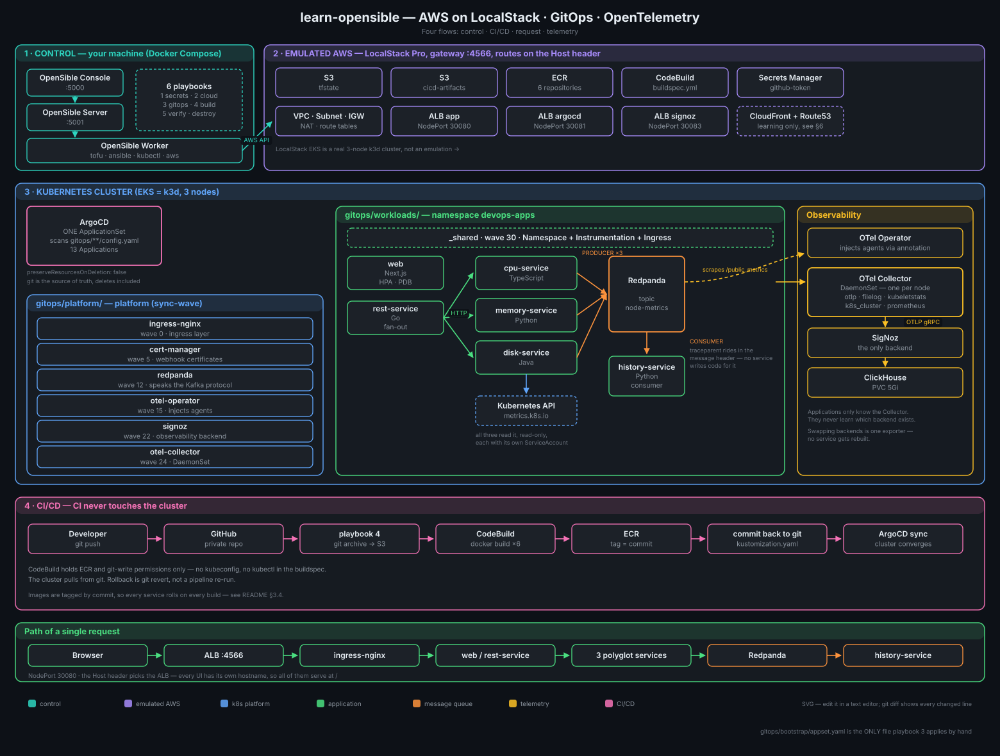

Read the four flows in order:

1. **Control** — trigger jobs in OpenSible; the worker executes `tofu`/`ansible`/`kubectl`
2. **CI/CD** — commit goes through CodeBuild to ECR, then **writes back to git**; the cluster reconciles automatically
3. **Request** — browser → ALB → ingress-nginx → web/rest-service → microservices → queue
4. **Telemetry** — all pods → Collector → SigNoz; applications remain backend-agnostic

---

## 1. Components

| Component | Address | Role |
| :--- | :--- | :--- |
| **OpenSible Console** | `http://localhost:5000` | Web UI: execute playbooks, inspect execution history |
| **OpenSible Server** | `http://localhost:5001` | Control plane, persists state in `./data/opensible` |
| **OpenSible Worker** | (internal) | Execution environment for `tofu`, `ansible`, `kubectl`, `aws` |
| **LocalStack Pro** | `http://localhost:4566` | Emulated AWS gateway, routes by `Host` header |
| | `localhost:4510-4559` | External service port range (EKS API, ECR…) |

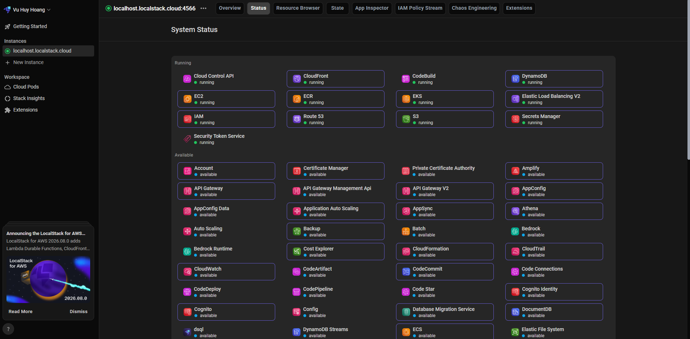

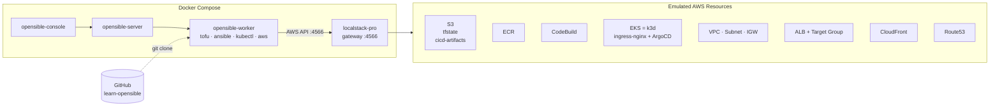

### 1.1 Repository Structure

Four directories, each answering a single concern:

```
learn-opensible/
├── iac/         "What AWS infrastructure exists?"     OpenTofu: VPC · EKS · ECR · ALB · S3
├── apps/        "What do applications do?"            Source code + Dockerfiles, 6 images, 4 languages
├── gitops/      "How should the cluster look?"        Manifests — consumed by ArgoCD
└── playbooks/   "Who triggers what, in what order?"   Ansible
```

`gitops/` consolidates the previous `k8s-infra/` and `k8s-manifest/` directories. The previous boundary between them was operational ("which is applied by Ansible vs which is applied by ArgoCD"), requiring two new Ansible tasks for every newly introduced platform component.

```
gitops/
├── bootstrap/                    Applied by Ansible — the only part outside ArgoCD management
│   ├── argocd/                   ArgoCD v2.13.2 installation manifests, vendored in repo
│   └── appset.yaml               ← Single ApplicationSet discovering child config.yaml files
├── platform/                     Platform infrastructure managed by ArgoCD
│   ├── ingress-nginx/            wave 0    Ingress networking layer
│   ├── cert-manager/             wave 5    Issues webhook certificates for operators
│   ├── redpanda/                 wave 12   Kafka-compatible message queue
│   ├── otel-operator/            wave 15   Injects auto-instrumentation agents via annotations
│   ├── signoz/                   wave 22   Observability backend (traces · logs · metrics · k8s)
│   └── otel-collector/           wave 24   Telemetry pipeline decoupled from backend
└── workloads/                    Applications managed by ArgoCD — 1 Application per service
    ├── _shared/                  wave 30   namespace · instrumentation · ingress
    ├── web/                      wave 35   deployment · service · sa · hpa · pdb
    ├── rest-service/             wave 35   deployment · service
    ├── cpu-service/              wave 35   deployment · service · rbac
    ├── memory-service/           wave 35   deployment · service · rbac
    ├── disk-service/             wave 35   deployment · service · rbac
    └── history-service/          wave 35   deployment · service
```

Each directory under `platform/` and `workloads/` contains a `config.yaml` specifying five fields:
`name`, `namespace`, **`manifestPath`**, `syncWave`, `prune`. The ApplicationSet scans `gitops/platform/*/config.yaml` and `gitops/workloads/*/config.yaml`, generating an `Application` for each discovered configuration.

> **Why `manifestPath` instead of `path`.** `path` is a **reserved keyword** in the git files generator — it automatically injects an *object* (`basename`, `filename`, `path`, `segments`) and overrides user values. This causes `spec.source.path` to render as `"map[basename:... filename:config.yaml ...]"`; Applications remain stuck in `SYNC: Unknown` while **HEALTH remains `Healthy`** (no child resources to fail health checks), with no error output. `goTemplateOptions: ["missingkey=error"]` also fails to catch this because the key exists with an incompatible data type.

Result: **adding a platform component = creating a directory + a 6-line file.** No Ansible edits required, no manual `Application` CRs, and new components receive automatic `selfHeal` support.

---

## 2. Getting Started

Prerequisites: Docker Desktop, a **LocalStack Pro auth token**, and a **GitHub token with WRITE permissions** (used by CodeBuild to write image tags back to `gitops/workloads/`).

```bash
# Create .env from template and configure credentials
cp .env.example .env
```

```bash
# .env
LOCALSTACK_PAT=<localstack auth token>
GITHUB_TOKEN=<github token with write permissions>
```

```bash
docker compose up -d
docker compose ps
```

Open `http://localhost:5000`, create a project pointing to this repository, and execute **`1.manage-secrets`** first. It reads `GITHUB_TOKEN` and registers it in AWS Secrets Manager.

**`.env` is the ingestion source, not what playbooks read from.** Following this step, all remaining playbooks and CodeBuild retrieve tokens directly from Secrets Manager using IAM credentials without referencing `.env`:

- Tokens are excluded from `start-build` command strings → not exposed in `ps` output.
- Tokens are excluded from environment overrides stored in CodeBuild build history.
- All consumers read from a single centralized secret source controlled via IAM.

To rotate tokens: update `.env` → `docker compose up -d opensible-worker` → re-run `1.manage-secrets`.

> `.env` is ignored by git (`.gitignore`) to ensure sensitive tokens and credentials are never committed. Use `.env.example` as a template when setting up new environments.

Next, run the playbooks sequentially as described in [§3](#3-workflows).

> **Regarding state persistence:** `PERSISTENCE=1` is enabled (see `docker-compose.yml`), allowing emulated resources — including OpenTofu state buckets — to survive container restarts. Without persistence, restarting containers requires a full 15-20 minute re-provisioning cycle starting from `2.deploy-cloud-infra`.
>
> If emulated resources diverge significantly from git manifests, reset the environment with `docker compose down -v` and re-run playbook 2.

---

## 3. Workflows

All playbooks execute with `hosts: localhost` inside the `opensible-worker` container and **automatically clone the repository from GitHub** rather than reading local files. Any changes must be committed and pushed (`git push`) before executing playbooks.

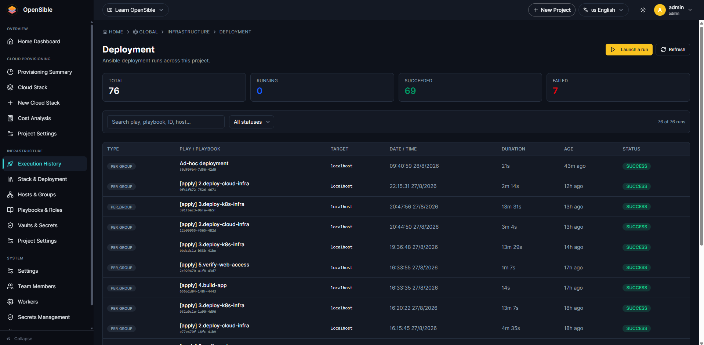

### 3.1 `1.manage-secrets.yml` — Secret Ingestion (Initial Step)

Pushes the GitHub PAT to AWS Secrets Manager. Must be run **once before any other playbook**, as subsequent steps authenticate against Secrets Manager to clone code. Re-run as needed for secret rotation. Details in [§8](#8-secrets-management).

### 3.2 `2.deploy-cloud-infra.yml` — Infrastructure Provisioning

Provisions or updates cloud infrastructure, configures kubeconfig, and registers EKS nodes with the ALB.

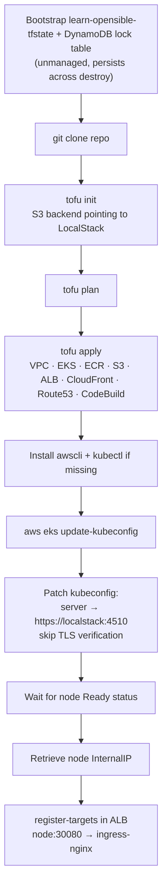

Infrastructure declared in [`iac/`](iac/):

| File | Resources |
| :--- | :--- |
| [`network.tf`](iac/network.tf) | VPC `10.0.0.0/16`, 2 private + 2 public subnets, IGW, **NAT Gateway + private route tables** |
| [`eks.tf`](iac/eks.tf) | EKS cluster `learn-opensible-dev` + node group (emulated via k3d) |
| [`ecr.tf`](iac/ecr.tf) | Repository `learn-opensible-web-app` + lifecycle policy (prunes untagged images, retains last 10 tags) |
| [`s3.tf`](iac/s3.tf) | `learn-opensible-cicd-artifacts` (versioning + encryption + public access block + lifecycle). State bucket `learn-opensible-tfstate` is unmanaged and created by bootstrap playbook |
| [`iam.tf`](iac/iam.tf) | IAM roles for EKS cluster and nodes |
| [`alb.tf`](iac/alb.tf) | Security groups, ALB, port 80 listener, target group port 30080 (ingress-nginx NodePort) with `/healthz` health check. `target_type` = `ip` for local, `instance` for AWS |
| [`cloudfront.tf`](iac/cloudfront.tf) | Distribution with custom origin pointing to ALB |
| [`route53.tf`](iac/route53.tf) | Hosted zone + alias record `www.<zone>` → CloudFront |
| [`codebuild.tf`](iac/codebuild.tf) | Project `learn-opensible-build`, S3 source, **inline** buildspec |
| [`acm.tf`](iac/acm.tf) | TLS certificate for CloudFront custom domain, pinned to `us-east-1` (real AWS only) |
| [`secrets.tf`](iac/secrets.tf) | IAM ARN scoping — does not create secrets directly, see [§8](#8-secrets-management) |

### 3.3 `3.deploy-k8s-infra.yml` — GitOps Bootstrap

Following the consolidation into `gitops/`, this playbook **no longer installs platform infrastructure directly**. It bootstraps the GitOps engine and delegates lifecycle management:

| Step | Reason ArgoCD cannot handle this directly |
| :--- | :--- |
| Install ArgoCD | Bootstrap paradox — cannot manage its own initial installation |
| Ingest 3 Secrets from Secrets Manager | Secret values must not reside in git (can be handled via External Secrets Operator, [§8.8](#88-future-improvements)) |
| Register node in ALB target group | AWS API operation, outside Kubernetes reconciliation scope |

The playbook applies a **single manifest** — [`gitops/bootstrap/appset.yaml`](gitops/bootstrap/appset.yaml) — and completes. ingress-nginx, Redpanda, SigNoz, Collector, and application workloads are discovered and reconciled automatically by ArgoCD according to `sync-wave` definitions.

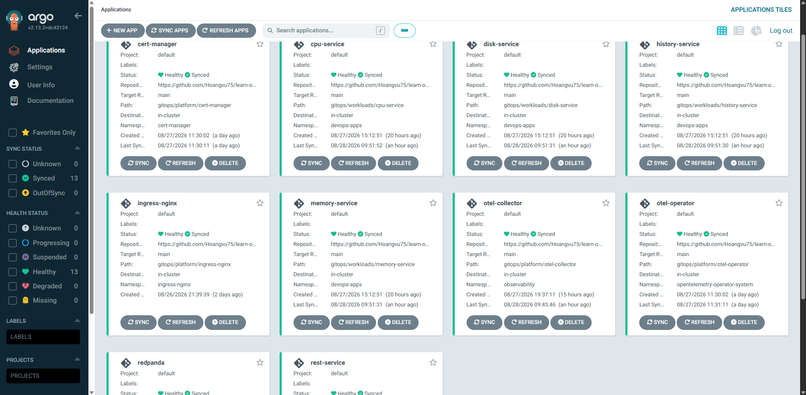

Playbook tasks were reduced from 32 to 26 without growing in size when adding new services.

> Note on templating: `prune` is a **boolean** field in CRDs. Placing `prune: {{ .prune }}` directly in YAML templates causes parsing failures (`found unhashable key`). The solution is `templatePatch`: rendered as a **string** and merged on top of generated `Application` resources.

### 3.4 `4.build-app.yml` + `buildspec.yml` — CI Pipeline

`4.build-app.yml` acts as the trigger webhook (simulating `git push` webhooks in local environments). It skips builds if an image with the current commit tag already exists on ECR (`-e force_build=true` to override).

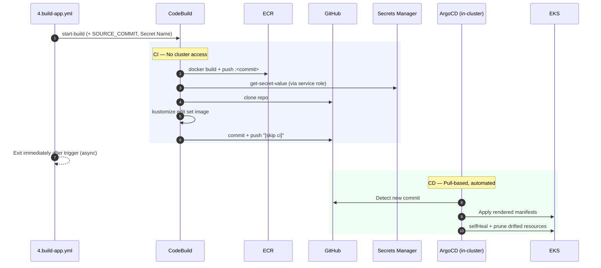

Key GitOps properties:

- **CI does not hold cluster credentials.** CodeBuild only requires ECR push and git write access. No `kubectl` commands in buildspec.
- **Desired state resides strictly in git.** `gitops/workloads/<service>/kustomization.yaml` is the single source of truth; rollbacks are handled via `git revert`.
- **Automated drift correction.** `selfHeal: true` reverts manual changes; `prune: true` deletes resources removed from git.

Manifests use **Kustomize** rather than inline `sed` replacements. Each service has its own directory where `kustomization.yaml` defines image overrides:

```
gitops/workloads/cpu-service/
├── config.yaml         ApplicationSet configuration
├── kustomization.yaml  namespace + images.newName/newTag  ← CI/CD handover point
├── deployment.yaml
├── service.yaml
└── rbac.yaml
```

Using flat service directories avoids shared overlay merge conflicts where concurrent builds overwrite image tags.

### 3.5 `5.verify-web-access.yml` — Diagnostic Verification

Non-destructive diagnostic playbook traversing the network path from pod outward:

- Verifies pod status and probes NodePort directly.
- **Re-registers node IP in ALB target group** (handles IP changes upon k3d recreation) and checks target health.
- Probes ALB and CloudFront endpoints, reporting `status | bytes | content-type`.
- Bisects `/_next/static/*` assets: fetches via ALB vs Kubernetes API proxy to isolate asset missing errors from routing drops.
- Compares curl requests against browser header requests and keep-alive connections.
- Inspects Route53 record sets and DNS lookups, comparing against unmapped hostnames.

All probes utilize `curl --resolve` targeting the LocalStack IP directly to bypass host loopback resolution.

### 3.6 `destroy-cloud-infra.yml` — Teardown

Executes `tofu destroy -auto-approve`. State buckets, DynamoDB lock tables, and Secrets Manager secrets survive teardown.

This playbook intentionally omits numeric prefixes to prevent accidental execution in sequential workflows.

---

## 4. Request Routing Flow

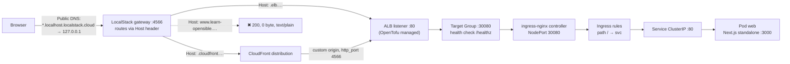

### 4.1 Architecture: ALB + Ingress-Nginx

Rather than running the AWS Load Balancer Controller inside LocalStack (which introduces OIDC, EC2 API mocking, and certificate validation complexities in local k3d environments), the project implements a standard **L4 ingress with L7 controller** architecture:

```
CloudFront → ALB (OpenTofu) → ingress-nginx NodePort 30080 → Ingress rules → ClusterIP Service → Pod
```

- **Manifests remain identical on AWS.** `ingressClassName: nginx`, Ingress rules, and Services require no changes.
- [`gitops/workloads/_shared/ingress.yaml`](gitops/workloads/_shared/ingress.yaml) provides annotations for both `alb.ingress.kubernetes.io/*` and `nginx.ingress.kubernetes.io/*`.
- Ingress-Nginx manifests (`v1.11.3` baremetal) are vendored in [`gitops/platform/ingress-nginx/`](gitops/platform/ingress-nginx/) with static `nodePort: 30080` binding matching ALB target configurations.

### 4.2 Endpoint URLs

Endpoints use public wildcard DNS under `localhost.localstack.cloud` resolving to `127.0.0.1`:

```
ALB        http://learn-opensible-alb.elb.localhost.localstack.cloud:4566/
CloudFront http://<distribution-id>.cloudfront.localhost.localstack.cloud:4566/
```

Retrieve exact hostnames using `tofu output` or via `5.verify-web-access.yml`.

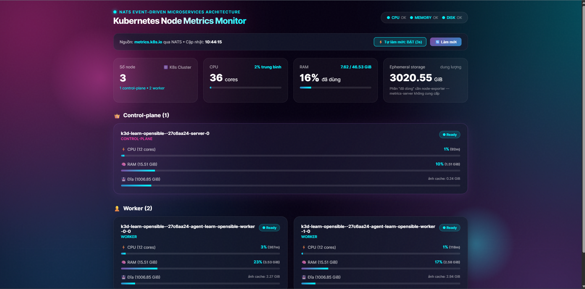

---

## 5. Why Endpoints Use Port `:4566`

LocalStack multiplexes emulated AWS services through a single gateway port `4566`, dispatching requests based on the HTTP `Host` header.

---

## 6. LocalStack Limitations

### 6.1 CodeBuild

| Symptom | Cause | Workaround |
| :--- | :--- | :--- |
| Build container exits with code 2 (`fatal error: stack overflow` in `resolveBuildspec`) | Recursive resolution on relative buildspec file paths | Inline buildspec definition using `file("${path.module}/../buildspec.yml")` in [`codebuild.tf`](iac/codebuild.tf) |
| Pod image pulls fail with `ImagePullBackOff` (`x509: certificate has expired`) | LocalStack caches certificates in `data/localstack/cache/server.test.pem` (~90 day validity) | Restart LocalStack container (`docker compose up -d localstack`) to refresh certificates |
| Build finishes but `batch-get-builds` reports `IN_PROGRESS` | LocalStack does not sync container exit status back to the CodeBuild record | `4.build-app.yml` triggers builds asynchronously without blocking |
| `docker logs` inside playbook fails | Worker container lacks `docker` CLI binary | View build logs directly from host terminal via `docker logs` |
| Project `environment_variable` values not received in buildspec | LocalStack does not inject project-level environment variables | Pass via `start-build --environment-variables-override` |
| Shell variables do not persist across phases | Each phase runs in a distinct process | Wrap phase logic in a single execution block `\|` and export cross-phase state to `/tmp/build_vars.env` |

### 6.2 ECR & EKS

| Symptom | Cause | Workaround |
| :--- | :--- | :--- |
| Dynamic registry host:port cannot be guessed | LocalStack assigns ports dynamically within 4510-4559 | Query via API: `aws ecr describe-repositories --query repositories[0].repositoryUri` |
| `kubectl` reports TLS connection errors after `update-kubeconfig` | Cluster endpoint IP differs inside container network | Configure `kubectl config set-cluster --server=https://localstack:<port> --insecure-skip-tls-verify=true` |
| Node IP changes after cluster recreation | k3d reallocates internal container IPs | `5.verify-web-access.yml` re-registers targets on demand |

### 6.3 ALB, CloudFront, Route53

| Symptom | Cause | Workaround |
| :--- | :--- | :--- |
| `http://<alb-dns>/` unreachable | Port 80 is not bound directly | Append gateway port `:4566` |
| CloudFront returns blank responses | Origin default points to port 80 | Set origin `http_port = var.is_local ? 4566 : 80` |
| CloudFront serves blank HTML in browser while curl returns content | Proxy returns uncompressed body with `Content-Encoding: gzip` | Set `compress: false` in [`next.config.js`](apps/web/next.config.js) |
| `www.<zone>` returns `200, 0 byte, text/plain` | Gateway routes by static hostname pattern rather than Route53 records | Access via CloudFront distribution domain directly |

### 6.4 CSRF Protection

- **Symptom:** Web application loads HTML without CSS or static JS assets (`403 FORBIDDEN` for `/_next/static/*`).
- **Cause:** LocalStack CSRF protection blocks requests with unlisted `Origin`/`Referer` headers.
- **Resolution:** Set `DISABLE_CORS_CHECKS=1` in [`docker-compose.yml`](docker-compose.yml) for local development.

### 6.5 DNS Hijacking of Real CDNs

- **Symptom:** Pulling external container images from `registry.k8s.io` fails with certificate verification errors for `cloudfront.net`.
- **Cause:** LocalStack resolves `*.cloudfront.net` requests to its local gateway.
- **Resolution:** Configure `DNS_NAME_PATTERNS_TO_RESOLVE_UPSTREAM` in `docker-compose.yml` to forward external CDN domains to upstream DNS resolvers.

---

## 7. Migrating to Real AWS

### 7.1 Required Changes

| # | Component | Migration Step |
| :-- | :--- | :--- |
| 1 | **Credentials & Endpoint** | In [`terraform.tfvars`](iac/terraform.tfvars): set `aws_endpoint = ""`, `is_local = false`, and supply authentic IAM credentials |
| 2 | **Backend State** | Extract state bucket and DynamoDB lock table provisioning into a dedicated bootstrap stack |
| 3 | **Multi-AZ NAT Gateway** | Provision Multi-AZ NAT Gateways with dedicated route tables in [`network.tf`](iac/network.tf) for high availability |
| 4 | **Worker EKS Permissions** | Grant worker IAM role access via `eks_admin_principal_arn` in [`eks.tf`](iac/eks.tf) |
| 5 | **ALB Target Registration** | Switch `target_type` to `instance` and attach Target Groups to Auto Scaling Groups |
| 5b | **Ingress Controller** | Deploy `ingress-nginx` via Helm with configured HPA and PodDisruptionBudgets |
| 6 | **ACM TLS Certificates** | [`acm.tf`](iac/acm.tf) issues certificates in `us-east-1` for CloudFront; configure HTTPS redirect |
| 7 | **Route53 Domain** | Delegate domain NS records to values returned by `tofu output route53_nameservers` |
| 8 | **ECR Tag Immutability** | Set `image_tag_mutability = "IMMUTABLE"` in [`ecr.tf`](iac/ecr.tf) |
| 9 | **GitHub Token** | Revoke development PATs and configure dedicated CI secrets in Secrets Manager |
| 10 | **IAM Roles for Service Accounts** | Attach IAM roles to worker compute instances instead of embedding credentials |
| 11 | **Internal ALB Access** | Ensure VPN or bastion access for internal ArgoCD ALB endpoints |

### 7.2 Cleanup and Optimization

| Item | Rationale |
| :--- | :--- |
| `DISABLE_CORS_CHECKS` | Remove LocalStack-specific flags |
| `compress: false` | Re-enable compression and leverage CloudFront edge compression |
| `buildspec` Inline | Move back to external `buildspec.yml` file reference |
| Insecure TLS flags | Remove `--insecure-skip-tls-verify` from kubeconfig generation |
| Production Container Users | Enforce explicit non-root `USER` declarations in Dockerfiles |

---

## 8. Secrets Management

Secrets management is structured so that **git never stores secret values**, while all infrastructure remains declaratively defined.

### 8.1 Secret Boundaries

| Secret | Storage Location | Purpose |
| :--- | :--- | :--- |
| `LOCALSTACK_PAT` | `.env` | Bootstrap token for LocalStack Pro container initialization |
| OpenSible Internal Secrets | `.env` | Local server session and database keys |
| **GitHub PAT** (Consumption) | **AWS Secrets Manager** (`learn-opensible/github-token`) | Single secret source for playbooks and CodeBuild via IAM |
| **GitHub PAT** (Ingestion) | `.env` (`GITHUB_TOKEN`) | Consumed exclusively by `1.manage-secrets.yml` to populate Secrets Manager |

### 8.2 Trust Chain Architecture

In production, IAM instance profiles and IRSA provide machine identity without static long-lived credentials. Playbooks and CI runners authenticate directly with Secrets Manager using IAM policies scoped to `learn-opensible/*`.

### 8.3 Secret Flow

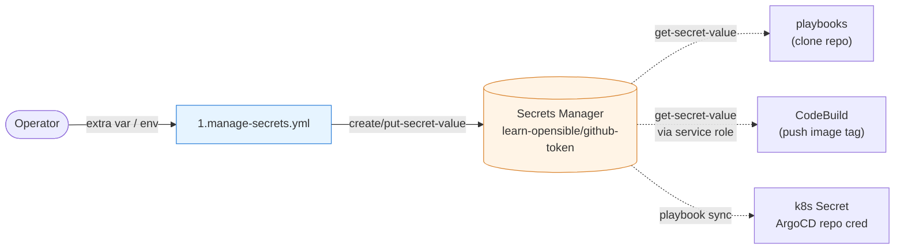

### 8.4 Secret Rotation

To rotate secrets:
```
Update .env → docker compose up -d opensible-worker → Run 1.manage-secrets.yml
```
`put-secret-value` creates a new secret version tagged `AWSCURRENT` while retaining previous versions tagged `AWSPREVIOUS` for instant rollback capability.

---

## 9. Observability: Logs, Traces, APM

Telemetry signals are collected centrally and exported to **SigNoz** via OpenTelemetry:

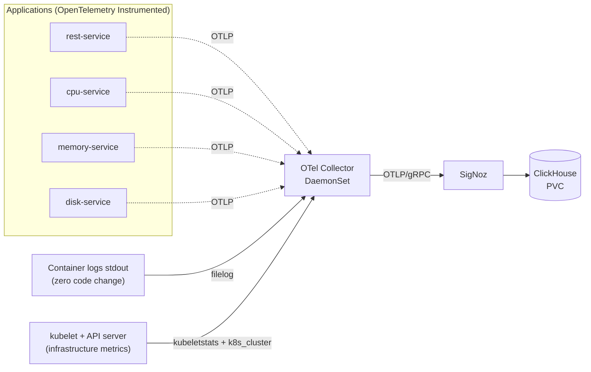

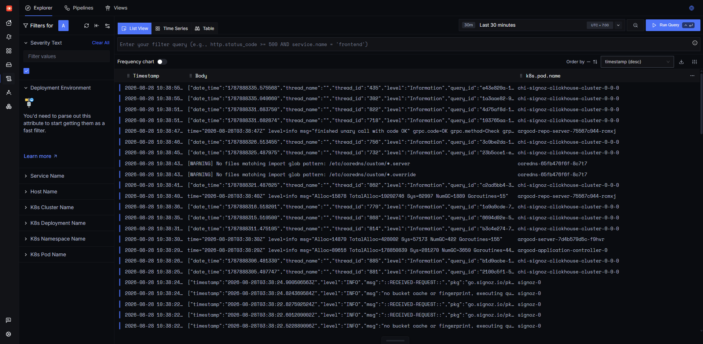

### 9.1 Decoupled Collector Architecture

Applications export telemetry exclusively to the local OpenTelemetry Collector DaemonSet. Changing backends (SigNoz, Tempo, Datadog) requires updating the Collector ConfigMap without modifying application code or rebuilding images.

### 9.2 End-to-End Trace Propagation via Message Queue

Using **Redpanda (Kafka protocol)** enables automatic trace propagation across microservices without custom instrumentation code:

```
apps/cpu-service/src/index.ts        0 lines OpenTelemetry
apps/memory-service/main.py          0 lines OpenTelemetry
apps/disk-service/.../DiskService.java 0 lines OpenTelemetry
apps/history-service/main.py         ~10 lines (transit span calculation)
```

Trace hierarchy across HTTP and Kafka transport layers:

```
GET /api/k8s-metrics                    SERVER     rest-service     Go
├─ HTTP GET → cpu-service               CLIENT     rest-service
│  └─ GET /api/metrics                  SERVER     cpu-service      TypeScript
│     ├─ GET ×2                         CLIENT     → Kubernetes API
│     └─ send node-metrics              PRODUCER   cpu-service      ← Enters Queue
│        ├─ redpanda transit            INTERNAL   history-service  ← Synthetic Span
│        └─ node-metrics receive        CONSUMER   history-service  Python
├─ HTTP GET → memory-service            CLIENT
│  └─ …                                            memory-service   Python
└─ HTTP GET → disk-service              CLIENT
   └─ …                                            disk-service     Java
```

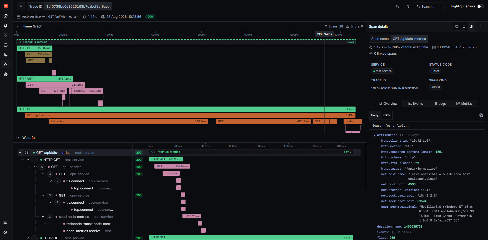

### 9.3 Synthetic Transit Spans

`history-service` calculates message queue transit time by extracting producer timestamps:

```python
ctx = propagate.extract({k: v.decode() for k, v in msg.headers})
span = _tracer.start_span("redpanda transit " + msg.topic, context=ctx,
                          start_time=msg.timestamp * 1_000_000)
span.end()
```

### 9.4 Multi-Language Implementation Summary

| Service | Language | Base Image | Uncompressed Disk Size |
| :--- | :--- | :--- | ---: |
| rest-service | **Go** | distroless static | **23 MB** |
| history-service | **Python** | python:3.12-slim | 217 MB |
| cpu-service | **TypeScript** | node:20-alpine | 235 MB |
| memory-service | **Python** | python:3.12-slim | 297 MB |
| disk-service | **Java** | temurin:21-jre-alpine | **407 MB** |

### 9.5 Secure Kubelet Metrics Access

Disk metrics are gathered directly from the kubelet `/stats/summary` endpoint over authenticated TLS using the cluster CA and bounded ServiceAccount tokens, avoiding privileged `nodes/proxy` RBAC assignments.

### 9.6 OpenTelemetry Operator Auto-Instrumentation

Workloads inject agents automatically using pod annotations:
```yaml
template:
  metadata:
    annotations:
      instrumentation.opentelemetry.io/inject-nodejs: "true"
      instrumentation.opentelemetry.io/inject-python: "true"
      instrumentation.opentelemetry.io/inject-java: "true"
```

Health check spans (`/health`, `/ready`, `/healthz`, `/metrics`) are filtered at the Collector layer to prevent trace spam.

### 9.7 Accessing Observability UI

SigNoz is exposed through a dedicated ALB:

```
http://learn-opensible-signoz-alb.elb.localhost.localstack.cloud:4566/
```

| NodePort | Service | ALB Endpoint |
| ---: | :--- | :--- |
| 30080 | ingress-nginx | Web application |
| 30081 | argocd-server | ArgoCD UI |
| 30083 | signoz | SigNoz UI |

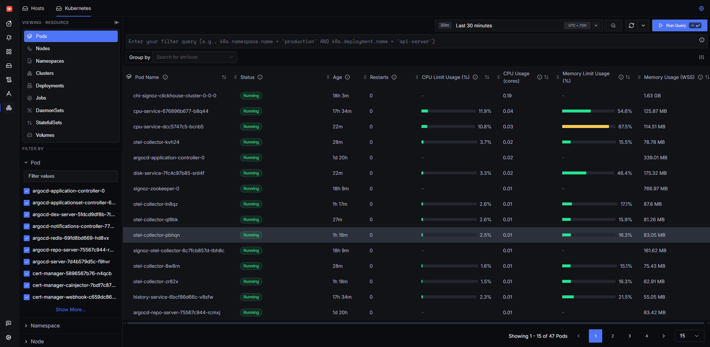

---

## 10. Useful Commands

```bash
# View service logs
docker compose logs -f opensible-server
docker compose logs -f localstack

# View OpenTofu outputs
tofu output

# Check latest CodeBuild build
BUILD_ID=$(docker exec opensible-worker aws codebuild list-builds-for-project \
  --project-name learn-opensible-build --endpoint-url http://localstack:4566 \
  --query "ids[0]" --output text)
docker logs -fn 100 "localstack-codebuild-${BUILD_ID##*:}"

# Inspect build status
docker exec opensible-worker aws codebuild batch-get-builds --ids "$BUILD_ID" \
  --endpoint-url http://localstack:4566 \
  --query "builds[0].{Status:buildStatus,Phase:currentPhase,Complete:buildComplete}" --output table

# Teardown local environment
docker compose down
docker compose down -v
```

See [`PROJECT_RULES.md`](PROJECT_RULES.md) for data directory rules and troubleshooting steps for locked playbook executions.

---

## 11. Change Execution Order

| Modified Component | Required Action |
| :--- | :--- |
| `iac/*.tf`, `buildspec.yml` | `git push` → `2.deploy-cloud-infra` |
| `apps/web/**` | `git push` → `4.build-app` (ArgoCD reconciles automatically) |
| `gitops/platform/**`, `gitops/workloads/**` | `git push` → ArgoCD detects and syncs automatically |
| `gitops/bootstrap/**` | `git push` → `3.deploy-k8s-infra` |
| **OpenTelemetry Config** (`instrumentation.yaml`) | `git push` → Restart pods (no image rebuilds required) |
| `playbooks/*.yml` | `git push` → Execute updated playbook |
| `docker-compose.yml` | `docker compose up -d` |
| `apps/*-service/**`, `apps/web/**` | `git push` → `4.build-app` |
| **GitHub Token Rotation** | `1.manage-secrets.yml` → `3.deploy-k8s-infra` to refresh ArgoCD repo secrets |
